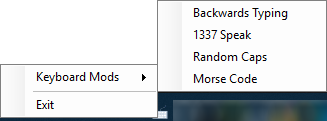

# What is this?
Keyboarder is a program that modifies the behavor of your keyboard in real-time to change the output of your keystrokes. It works by first detecting which character you typed, remove this character from the input panel you type in, and then replace this character with for example a morse-code representation of the character.

# Screenshot

# Mods available

| Mod              | Description                                                         |
| ---------------- |-------------------------------------------------------------------- | 
| Backwards Typing | As the name suggests, it allows you to type everything backwards.   |
| 1337 Speak       | This converts your characters into their leet speak representation. |
| Random Caps      | This tweak turns your caps lock on and off in a cycle. Due to the random nature of humans, the output characters will randomly be upper- and lower-case |
| Morse Code       | Converts all typed characters into their morse-code representation. |
